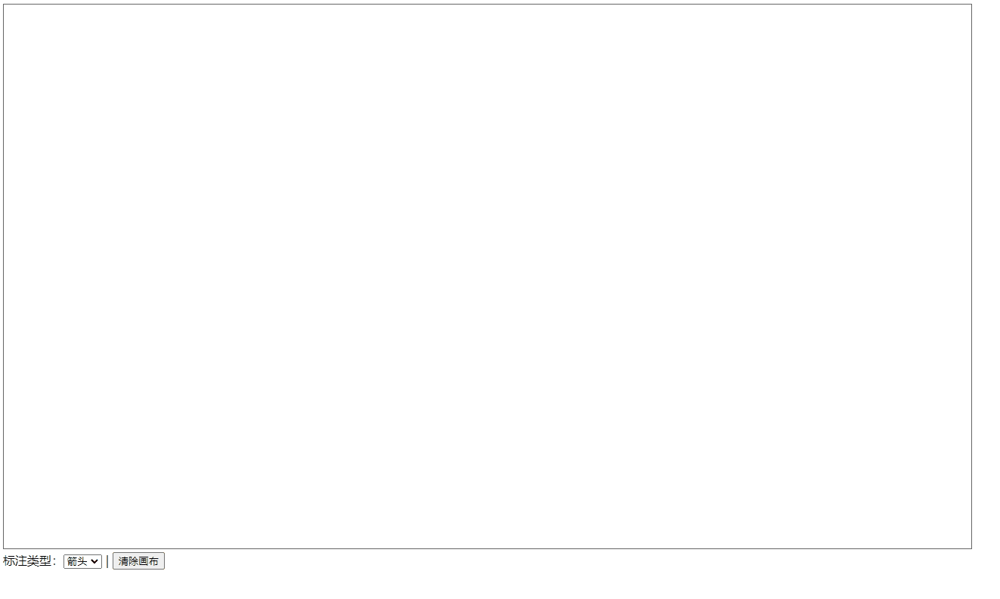

# A demo that show how to create a annotation on a canvas element

## start

install deps.

```bash
pnpm run build
```

start dev server

```bash
pnpm run build
```

open http://localhost:5173 in your browser.

then you can see follow page. and you can drag you mouse in rect to create a annotation.



there is a post [使用 canvas 来实现简单的批注功能](https://prohibitorum.top/648f3f0c7d1a.html) in my personal site. it show the principle of creating the annotation.